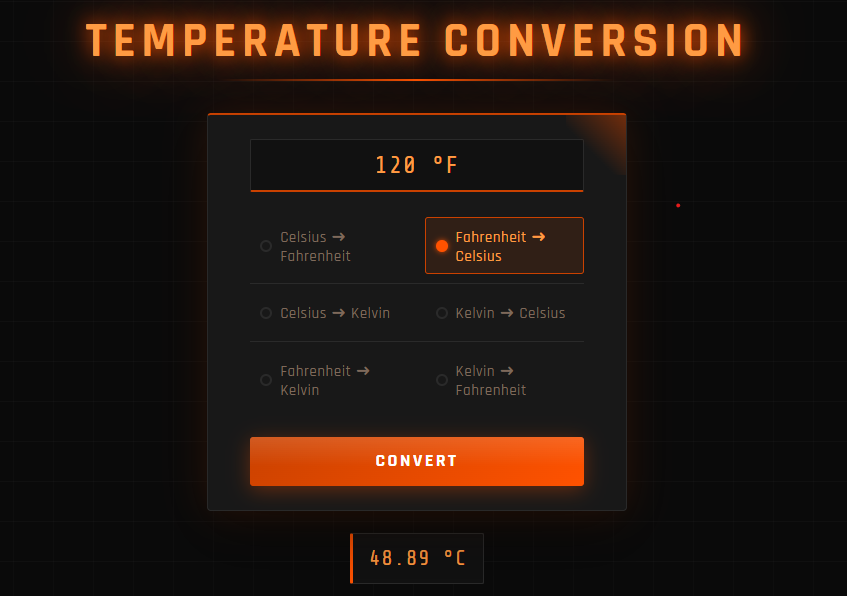

# Temperature Converter

A sleek temperature converter web app built with HTML, CSS, and vanilla JavaScript. Supports all six conversions between Celsius, Fahrenheit, and Kelvin. Features a black and orange themed UI, real-time input unit labeling on radio selection, input validation with error handling, and a clean result display.

## Features

- All six temperature conversions: Celsius, Fahrenheit, and Kelvin
- Real-time unit suffix on the input field when a radio button is selected
- Input validation with error message for non-numeric entries
- Custom black and orange themed UI with glowing accents and dark grid background
- Monospace number input and responsive card layout

## Preview

## Tech Stack

- HTML
- CSS
- JavaScript (Vanilla)

## How to Use

1. Enter a temperature value in the input field
2. Select a conversion type using the radio buttons
3. Click **Convert** to see the result

## Live Demo

[Click here to view the live site](https://syed-asad-745.github.io/temperature-converter)
